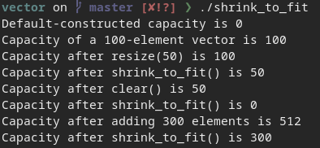

# Custom vektor klasė

Implementavau savo vektor klasę, kurią ištestavau ir panaudojau su studentų klase

## Kaip parunnint

 - `git clone https://github.com/dominykasmk/vector.git`
 - `cd vector`
 - `cmake -S src/ -B out/`
 - `cd out/ && make`
 - `./main`

## Testai
 
 
## Pratestavau 5 skirtingaų vektorių funkcijų veikima tarp custom ir std vektorių

## Palyginau kiek laiko užima užpildyti skirtingų dydžių vektorius

## Palyginau kiek kartu perskirstoma atmintis pildant 10000000 dydžio vektorius

## Palyginau trečiosios programos testų atlikimų greitį naudojant 100000 dydžio vektorius

